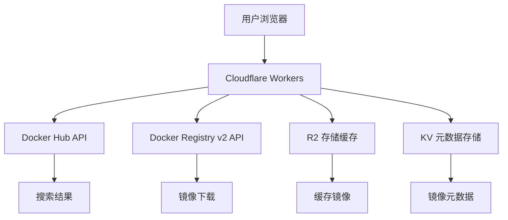

# Docker镜像下载器 - Cloudflare Workers版本

基于[Cloudflare Serverless Registry](https://github.com/cloudflare/serverless-registry)技术构建的高性能Docker镜像搜索和下载服务。运行在Cloudflare Workers平台上，提供全球分布式的镜像下载加速。

## ✨ 功能特性

- 🌐 **全球CDN加速** - 基于Cloudflare Workers，全球边缘计算节点
- 🔍 **智能搜索** - 搜索Docker Hub上的所有公开镜像
- 🚀 **高性能下载** - 多线程下载，支持大镜像文件
- 🏗️ **多架构支持** - 支持linux/amd64、arm64、windows等多种平台
- 💾 **智能缓存** - R2存储缓存热门镜像，加速重复下载
- 📱 **响应式界面** - 现代化Web界面，支持移动设备
- 🔒 **安全可靠** - 支持私有镜像仓库认证

## 🚀 快速开始

### 1. 环境准备

确保您有以下环境：
- Node.js 16+ 
- Cloudflare账户
- Wrangler CLI工具

```bash
# 安装Wrangler CLI
npm install -g wrangler

# 登录Cloudflare账户
wrangler login
```

### 2. 项目设置

```bash
# 克隆或下载项目
cd cloudflare-worker

# 安装依赖
npm install

# 复制配置文件
cp wrangler.toml.example wrangler.toml
```

### 3. 创建R2存储桶（可选）

为了获得更好的性能，建议创建R2存储桶用于缓存：

```bash
# 创建R2存储桶
wrangler r2 bucket create docker-image-cache --env production

# 创建KV命名空间（用于元数据）
wrangler kv:namespace create "METADATA" --env production
```

更新 `wrangler.toml` 中的配置：

```toml
[env.production]
name = "docker-image-downloader-prod"

[[env.production.r2_buckets]]
binding = "DOCKER_CACHE"
bucket_name = "docker-image-cache"

[[env.production.kv_namespaces]]
binding = "METADATA"
id = "your-kv-namespace-id"  # 替换为实际的KV命名空间ID
```

### 4. 部署到Cloudflare Workers

```bash
# 构建项目
npm run build

# 部署到生产环境
npm run deploy

# 或者使用开发环境测试
npm run dev
```

## 📖 使用指南

### Web界面使用

1. **搜索镜像**
   - 在搜索框输入镜像名称（如：ubuntu, nginx, mysql）
   - 选择目标平台（Linux AMD64、ARM64等）
   - 点击搜索查看结果

2. **快速下载**
   - 在快速下载框中输入完整镜像名（如：ubuntu:22.04）
   - 选择平台和标签
   - **大镜像下载**: 勾选"使用流式下载"选项支持20GB+大镜像
   - 点击"立即下载"开始下载

3. **浏览热门镜像**
   - 页面底部显示热门和官方镜像
   - 一键下载常用镜像

### 大镜像下载支持

🌊 **流式下载模式**: 
- 支持任意大小的Docker镜像（包括20GB+）
- 实时进度显示和速度监控
- 内存使用优化，不受Worker内存限制
- 自动选择最佳下载策略

### API接口使用

#### 搜索镜像
```bash
curl -X POST https://your-worker.your-subdomain.workers.dev/api/search \
  -H "Content-Type: application/json" \
  -d '{"query": "ubuntu", "limit": 10}'
```

#### 下载镜像（标准模式，<500MB）
```bash
curl -X POST https://your-worker.your-subdomain.workers.dev/api/download \
  -H "Content-Type: application/json" \
  -d '{"image": "ubuntu:22.04", "platform": "linux/amd64"}' \
  --output ubuntu-22.04.tar
```

#### 下载大镜像（流式模式，支持20GB+）
```bash
curl -X POST https://your-worker.your-subdomain.workers.dev/api/download-stream \
  -H "Content-Type: application/json" \
  -d '{"image": "tensorflow/tensorflow:latest-gpu", "platform": "linux/amd64"}' \
  --output tensorflow-latest-gpu.tar
```

#### 获取热门镜像
```bash
curl https://your-worker.your-subdomain.workers.dev/api/popular
```

#### 获取镜像详情
```bash
curl -X POST https://your-worker.your-subdomain.workers.dev/api/image-details \
  -H "Content-Type: application/json" \
  -d '{"image": "ubuntu"}'
```

## 🔧 配置选项

### 支持的平台

- `linux/amd64` - Linux 64位 (默认)
- `linux/arm64` - Linux ARM 64位
- `linux/arm/v7` - Linux ARM v7
- `linux/arm/v6` - Linux ARM v6
- `linux/386` - Linux 32位
- `windows/amd64` - Windows 64位
- `darwin/amd64` - macOS Intel
- `darwin/arm64` - macOS Apple Silicon

### 环境变量

在 `wrangler.toml` 中配置：

```toml
[env.production.vars]
ENVIRONMENT = "production"
# 其他自定义配置...
```

### 缓存配置

- **搜索结果缓存**: 5分钟
- **热门镜像缓存**: 1小时  
- **镜像详情缓存**: 30分钟
- **下载文件缓存**: 24小时（R2存储）

## 🏗️ 架构设计



## 🚦 性能优化

1. **全球分布式边缘节点**
   - Cloudflare在全球330+城市的数据中心
   - 就近访问，减少延迟

2. **智能缓存策略**
   - 热门镜像自动缓存到R2存储
   - 减少重复下载时间

3. **并行下载**
   - 多个镜像层并行下载
   - 优化大镜像下载速度

4. **压缩传输**
   - 自动gzip压缩响应
   - 减少网络传输时间

## 🛠️ 本地开发

```bash
# 安装依赖
npm install

# 启动开发服务器
npm run dev

# 运行测试
npm test

# 构建项目
npm run build
```

## 📊 监控和日志

在Cloudflare Dashboard中可以查看：
- 请求数量和错误率
- 响应时间分布
- 缓存命中率
- R2存储使用量

## 🔒 安全说明

- 支持Docker Hub认证（用户名/密码）
- 支持私有镜像仓库
- 所有数据传输使用HTTPS加密
- 不存储用户凭证

## 📝 限制说明

- 单个文件最大500MB（Workers限制）
- 每分钟最多100个请求（可调整）
- R2存储按使用量计费

## 🤝 贡献指南

欢迎提交Issue和Pull Request！

1. Fork本项目
2. 创建功能分支：`git checkout -b feature/new-feature`
3. 提交更改：`git commit -am 'Add new feature'`
4. 推送分支：`git push origin feature/new-feature`
5. 提交Pull Request

## 📄 许可证

MIT License - 详见 [LICENSE](LICENSE) 文件

## 🆘 问题排查

### 常见问题

1. **部署失败**
   ```bash
   # 检查wrangler配置
   wrangler whoami
   wrangler kv:namespace list
   ```

2. **下载失败**
   - 检查镜像名称是否正确
   - 确认平台支持
   - 查看Worker日志

3. **缓存问题**
   ```bash
   # 清理R2缓存
   wrangler r2 object delete docker-image-cache <object-key>
   ```

### 获取帮助

- 📧 Email: [your-email@example.com]
- 💬 GitHub Issues: [项目地址]
- 📖 Cloudflare Workers文档: https://developers.cloudflare.com/workers/

---

基于[Cloudflare Serverless Registry](https://github.com/cloudflare/serverless-registry)技术构建 ❤️